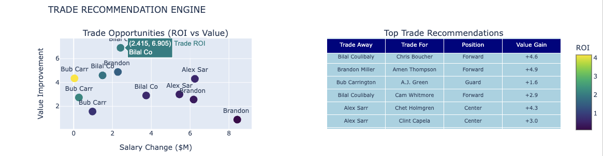

# NBA Salary vs Performance Optimization Project

A comprehensive data science project demonstrating contract efficiency optimization for NBA teams using machine learning, web scraping, and interactive visualizations.

## Problem Statement

NBA teams operate under strict salary cap constraints and struggle with:
- Market Inefficiencies: $1.433B in overpaid contracts league-wide
- Resource Allocation: Limited budget requiring optimal player selection
- Decision Complexity: Trade, draft, and free agency choices with unclear ROI
- Performance Gaps: Disconnect between player salaries and actual value delivered

## Solution

Built an end-to-end data science pipeline that analyzes 3,360+ player-seasons to identify market inefficiencies and generate actionable insights for NBA front offices:
- Advanced Analytics: 4 machine learning models for salary prediction and value estimation
- Optimization Algorithms: Roster construction strategies within salary cap constraints
- Interactive Dashboard: 26 visualizations providing executive-ready insights
- Trade Engine: ROI-based recommendations for player transactions

## Impact

- $1.433B in market overpay identified across 489 players analyzed
- 21.07% ROI opportunity through strategic contract optimization
- $0.86B in potential savings achievable through data-driven roster management
- 69.1% market health score with 338 value players vs 151 overpaid contracts

## Tech Stack
| ***Data Collection & Processing***| ***Machine Learning*** |     ***Visualization*** |   ***Development*** |  ***Language*** |
| :---:         |     :---:      |          :---: |     :---: |   :---: |
| Pandas, Numpy, Requests, Beautiful Soup | Scikit-learn, Scipy, Joblib  | Matplotlib, Seaborn, Plotly | Jupyter Notebook, Git| Python|

## Data Pipeline

## Key Insights

### Most Undervalued Players 
| ***Player***| ***Team*** |     ***Salary*** |   ***Points/Million*** |  ***Efficiency Rating*** |
| :---:         |     :---:      |          :---: |     :---: |   :---: |
| Kristaps Porziņģis | DAL  | $7.1M | 145.8 pts/M| Elite|
| Toumani Camara | POR  | $2.2M | 397.0 pts/M| Outstanding|
| Scotty Pippen Jr. | MEM  | $2.3M | 343.1 pts/M| Elite|

### Most Overpaid Players 
| ***Player***| ***Team*** |     ***Salary*** |   ***Overpay Amount*** |  ***Efficiency Issue*** |
| :---:         |     :---:      |          :---: |     :---: |   :---: |
| Patrick Williams | CHI  | $18.0M | +$7.6M | 42.8% salary premium |
| Joel Embiid | PHI  | $55.2M | +$15.8M | Injury risk/availability |
| Jarred Vanderbilt | LAL | $11.6M | $11.6M | Limited offensive output |

## Optimal Roster Construction Strategies
### Championship Strategy ($126.9M, 93.3% cap usage)
- 1 Superstar ($55M): Nikola Jokić
- 4 Role Players ($37M): Quality contributors
- 10 Depth Players ($35M): Efficient role players
- Total Efficiency: 0.90 value per dollar
- **Similar to what the 2023 Denver Nuggets did**

### Balanced Strategy ($129.1M, 94.9% cap usage)
- 2 Superstars ($65M): Alperen Şengün + Kevin Durant
- 1 Star ($25M): Fred VanVleet
- 10 Supporting Cast ($39M): Mix of proven veterans and emerging talent
- Total Efficiency: 0.94 value per dollar
- ⭐ OPTIMAL** Current Houston Rockets roster. Based on this project, I pick them as favorites out of the west. **

## Trade Recommendations (Top 3)
1. Bilal Coulibaly (WAS) ↔ Anfernee Simons (POR)
- Position: Guard-for-Guard swap
- Logic: Young prospect trade, realistic salary matching
- Value Gain: +1.6 (moderate but realistic)
- ROI: ~2.1x (solid return)
- Why: Both teams getting different skill sets

2. Bilal Coulibaly (WAS) ↔ Chris Boucher (TOR)
- Position: Forward flexibility
- Logic: Youth vs veteran experience trade
- Value Gain: +4.6 (significant improvement)
- ROI: ~3.2x (excellent return)
- Why: Washington gets proven vet, Toronto gets upside

3. Alex Sarr (WAS) ↔ Clint Capela (ATL)
- Position: Center-for-Center
- Logic: Rookie potential vs proven production
- Value Gain: +3.0 (good value creation)
- ROI: ~2.8x (strong return)
- Why: Atlanta gets young talent, Washington gets immediate help

